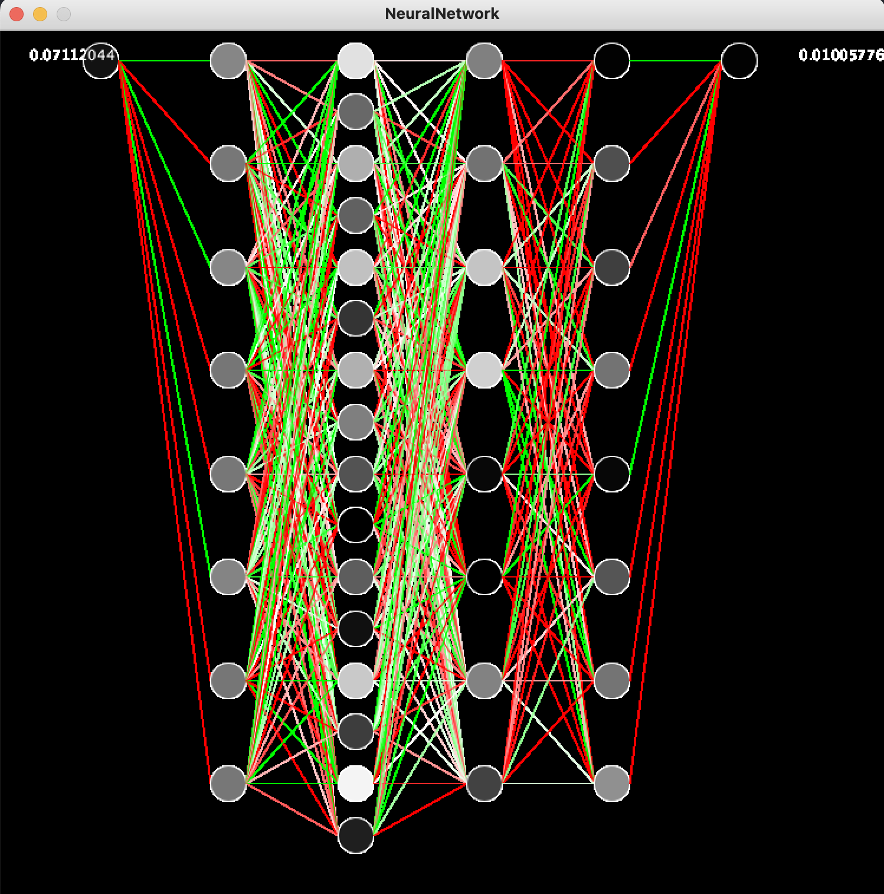

# NeuralNetwork
From-Scratch Layered Neural Network

Contains my code to generate arbitrary layered neural networks, complete with Sigmoid and RELU options for activation functions, and an in-built from-scratch backpropagation algorithm. Since it's only a basic neural network it's mostly only useful for basic linear regression problems, but it was a valuable project for learning. Will create new repositories for other net types, like the Convolutional and Recurrent Neural Networks.

